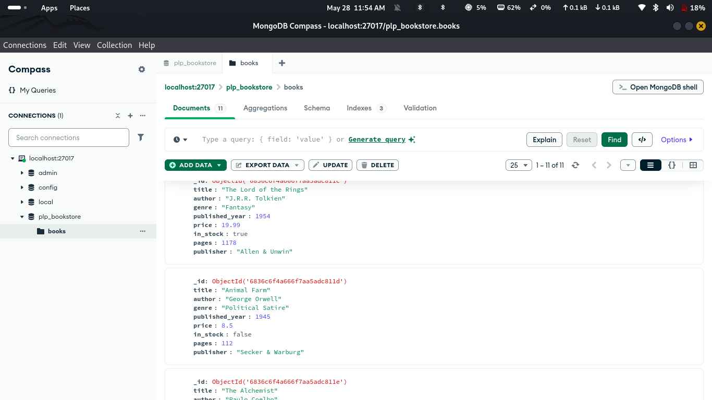

# 🎨 Week 3: React.js, JSX, and Tailwind CSS – Front-End Assignment

Welcome to my Week 3 assignment! This project is a responsive React application built with Vite, JSX, Tailwind CSS, and React Router. It demonstrates component architecture, state management with hooks, and integration with a public API.

---

## 🚀 Features

- 🔹 Reusable UI components (`Button`, `Card`, `Navbar`, `Footer`)
- 🔄 Task Manager with add, delete, complete, and filter
- 🌐 API integration with JSONPlaceholder
- 🌗 Light & Dark theme toggle
- 📱 Fully responsive layout (mobile-first design)
- 💨 Styled with Tailwind CSS utility classes

---

## 🛠️ Technologies Used

- ⚛️ React.js (via Vite)
- 🧠 React Hooks (`useState`, `useEffect`, `useContext`)
- 🧩 Custom Hook: `useLocalStorage`
- 💅 Tailwind CSS
- 🔗 React Router
- 🌐 JSONPlaceholder API

---

## 📸 Screenshot

---

## 📂 Folder Structure

📁 src
├── components/
│ ├── Button.jsx
│ ├── Card.jsx
│ ├── Footer.jsx
│ ├── Navbar.jsx
│ ├── TaskManager.jsx
│ └── Posts.jsx
├── layouts/
│ └── Layout.jsx
├── pages/
│ └── Home.jsx
├── context/
│ └── ThemeContext.jsx
├── hooks/
│ └── useLocalStorage.js
├── App.jsx
└── main.jsx

---

## 📦 Installation & Setup

Make sure Node.js (v18+) and npm are installed.

# Clone your repository
git clone https://github.com/PLP-MERN-Stack-Development/week-3-react-js-assignment-Spyr-coder.git
cd week-3-react-js-assignment-Spyr-coder

# Install dependencies
npm install

# Run the dev server
npm run dev
🌐 Live Demo
👉 View Deployed App on Netlify https://fanciful-sundae-fd7a7f.netlify.app/
